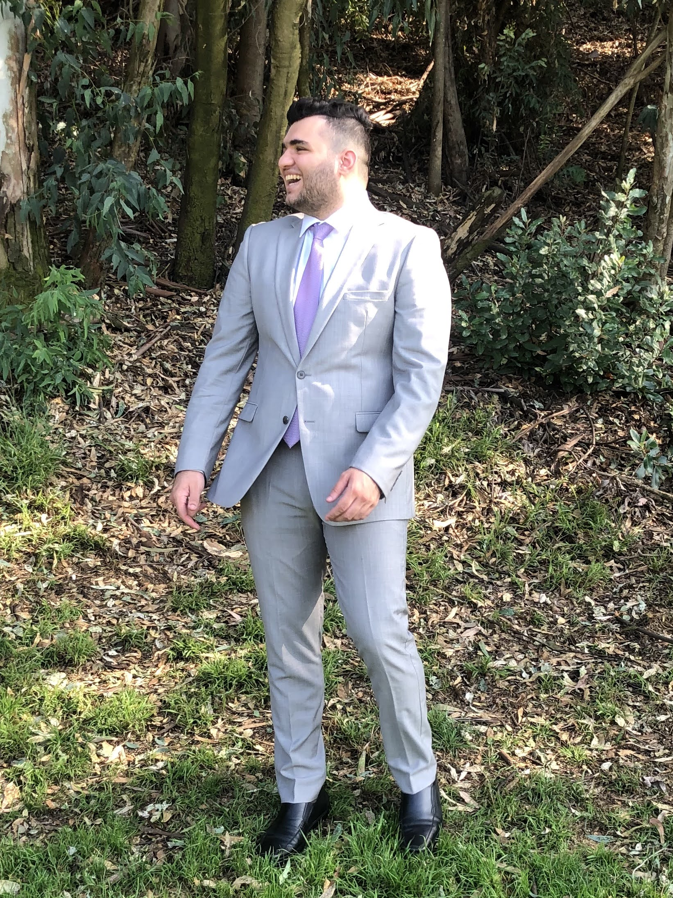

# Welcome to my Profile Page

## Table of Contents
-[Introduction](#introduction)

-   [Picture of myself](#picture-of-myself)

-   [Favorite Quote](#favorite-quote)      


-   [3 Favorite Boba Shops](#3-favorite-boba-spots)

-   [Programming Experience](#programming-experience)
  
-   [Current Goals](#current-goals)

### Introduction
Hello, my name is Tarek Tarif and I am currently a Senior majoring in Mathematics-Computer Science.My interests include:
- Basketball 
- Cats
- Boba
- Food
- Gaming
- Stock Market
- Application/Game development. 
#### Picture of myself


#### Favorite Quote
> Have I not destroyed my enemy when I have made him into my friend? 
- *Abraham Lincoln* 

#### 3 Favorite Boba Spots
    1. Omomo Tea Shoppe 
   

    
    2. Orobae
    3. Sunright Tea Studio

#### **Programming Experience**
```
while(true)
    print(Hello World :))
```
Most of my programming experiences derive from programming assignments from classes taken at UCSD. However, I used this past summer to strengthen my coding background by learning new languages and creating some applications in my spare time. A couple of examples are:
- Scientific Calculator
- Stock Price Tracker
- Youtube Search client
  
#### Current Goals
- [ ]  Get a Full-Time Job
- [ ]  Travel abroad to new countries
- [ ]  Graduate from UCSD